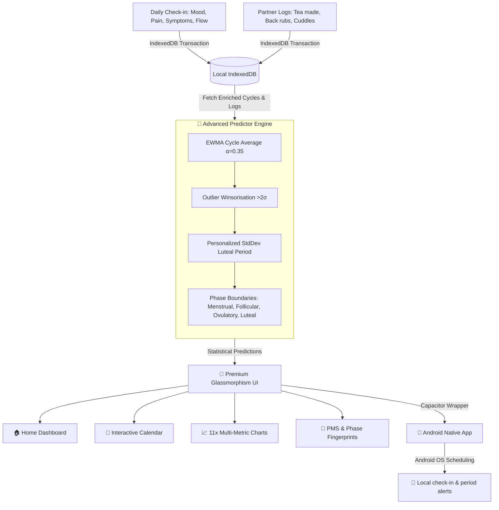

# 🌸 Bloom — Period & Wellness Tracker 💖

**Bloom** is a premium, privacy-first Progressive Web App (PWA) and native mobile application designed for tracking, predicting, and caring for menstrual cycles, wellness, mood, and symptoms. 

Whether used individually or in **Partner/Shared Mode**, Bloom helps demystify cycles with advanced scientific modeling and translates raw data into clear, actionable care suggestions—like reminding a partner when it's time to stock up on her favorite snacks or prepare a heating pad.

---

## 🎯 Vision & Philosophy

Most period trackers store sensitive health data in the cloud, exposing personal information to corporate servers. **Bloom takes a different stand**:
*   **100% Offline, Zero Cloud APIs**: All logged entries, names, symptoms, and PIN hashes are kept exclusively on the user's device.
*   **Privacy-First Architecture**: Powered by client-side browser storage (IndexedDB and LocalStorage), making data completely secure and inaccessible to third parties.
*   **Empathetic Partner/Shared Care**: Features designed specifically for partners to log wellness metrics, track what comfort actions worked best, and receive active suggestions to provide elite support.

---

## 📱 Interactive Preview & Architecture



---

## ✨ Key Features

### 🧠 1. Advanced Prediction Engine
Unlike generic calculators that assume a fixed 28-day cycle and a rigid 14-day luteal phase, Bloom personalizes prediction ranges based on advanced statistical modeling:
*   **EWMA (Exponentially Weighted Moving Average)**: Recent cycles are assigned a higher weight ($\alpha = 0.35$) to quickly adapt to body changes, while past cycles smooth out random fluctuations.
*   **Winsorisation (Outlier-Resistant)**: Cycles that deviate by more than two standard deviations ($>2\sigma$) from the running average are automatically down-weighted to prevent temporary stress or illness from skewing future predictions.
*   **Personalized Luteal Estimation**: Calculated directly from personal cycle patterns instead of assuming population means.
*   **Statistical Confidence Levels**: Outputs `HIGH`, `MEDIUM`, or `LOW` confidence metrics depending on historical consistency (Coefficient of Variation).

### 🔒 2. Device-Locked Private Security
*   **Secure Auth**: Local accounts are stored with individual profiles inside local browser storage.
*   **Lock Screen**: Custom secure PIN Lock screen (`#pin-lock`) using a local `djb2` non-colliding numeric hashing function to encrypt access on startup.
*   **No API Leaks**: Completely standalone architecture with no remote API keys, third-party trackers, or servers.

### 🤝 3. Empathy-Driven Partner/Shared Mode
*   **Partner Care Log**: Track what actions you took to support her (e.g., made her favorite chamomile tea, set up a heating pad).
*   **Relief Effectiveness Tracking**: Rate how much specific relief methods helped, building a tailored playbook of what works best for her.
*   **Proactive Partner Alerts**: Actionable home insights tell the partner when PMS is approaching, what symptoms she usually gets, and suggests specific comfort measures.

### 📈 4. Comprehensive Analytics & Insights
Visualizes cycle trends using 11 dynamic **Chart.js** charts:
1.  **😊 Mood Over Time**: Linear tracing of daily emotional well-being.
2.  **🔥 Pain Intensity**: Dynamic, color-coded bar chart mapping pain scales (0-10).
3.  **⚡ Energy Levels**: Tracking physical stamina across days.
4.  **😴 Sleep vs. Pain Correlation**: A scatter plot matching sleep quality with registered pain.
5.  **🩹 Top Symptoms**: Bar chart highlighting the most frequent physical and emotional symptoms.
6.  **💧 Flow Distribution**: Doughnut chart breaking down menstrual flow intensities.
7.  **💕 What She Needs Most**: Doughnut chart representing registered support needs.
8.  **📊 Mood by Cycle Phase**: Comparing average emotional states across the 4 phases.
9.  **💊 Relief Effectiveness**: Interactive ranking of what remedies provided the highest comfort.
10. **🍫 Cravings Breakdown**: Spotting cravings (sweet, salty, chocolate, carbs, etc.).
11. **🤝 Your Actions vs. Her Mood**: Tracks and visually demonstrates the positive impact of your partner care efforts!

---

## 🎨 Premium Aesthetics & UI System

Bloom features a gorgeous, immersive user interface designed from scratch with vanilla CSS:
*   **HSL Dynamic Palette**: Highly customized theme tokens supporting a fluid toggle between dark and light modes.
*   **Frosted Glassmorphism**: Translucent surfaces (`--bg-glass`), glowing accent borders, and radial background ambient gradients for a state-of-the-art modern feel.
*   **Outfit Typography**: Clean, high-readability sans-serif font family imported from Google Fonts.
*   **Adaptive Flow, Mood, and Pain Mappings**: Specific color schemes represent mood tags, flow intensities, and pain metrics for quick scanning.

---

## ⚙️ Technology Stack

*   **Core Logic**: Vanilla HTML5, CSS3 variables, and ES6 Javascript modules.
*   **Database**: HTML5 IndexedDB API (local database) + Web LocalStorage API.
*   **Visualizations**: [Chart.js (v4.4.7)](https://www.chartjs.org/) for beautiful, interactive, vector charts.
*   **Icons**: [Lucide Icons](https://lucide.dev/) for crisp, uniform iconography.
*   **Progressive Web App**: Offline Service Worker (`bloom-v9`), App Manifest v3.
*   **Mobile Engine**: [Ionic Capacitor (v6)](https://capacitorjs.com/) for compiling standard web assets into fully native applications.

---

## 🚀 Installation & Local Setup

### Option 1: PWA (Web Version)
Since Bloom is a pure client-side application, you can run it instantly using any local static web server.

#### Using Python (Recommended)
1. Open terminal in the project root:
   ```bash
   python -m http.server 3000
   ```
2. Navigate to `http://localhost:3000` in your web browser.

#### Using Node.js
1. Run standard http-server:
   ```bash
   npx http-server -p 3000
   ```
2. Open `http://localhost:3000` in your browser.

---

### Option 2: Native Android App (APK compilation)
You can compile Bloom into a fully functional native Android app.

#### Prerequisites
*   [Node.js](https://nodejs.org/) (v18+)
*   [Android Studio](https://developer.android.com/studio) (with Android SDK configured)

#### Setup Commands
1. Navigate into the mobile wrapper folder and install requirements:
   ```bash
   cd mobile-app
   npm install
   ```
2. Initialize, add the Android platform, and sync web assets:
   ```bash
   # Run the unified setup script
   npm run setup
   ```
3. Compile and open in Android Studio:
   ```bash
   npx cap open android
   ```
4. Build the application:
   * In Android Studio, wait for **Gradle Sync** to finish.
   * Go to **Build → Build Bundle(s) / APK(s) → Build APK(s)**.
   * Find your compiled APK in `mobile-app/android/app/build/outputs/apk/debug/app-debug.apk`.

---

## 🗂️ Project Structure

```
Periods-tracker/
├── css/
│   ├── variables.css      # Harmonious HSL color variables & design tokens
│   ├── base.css           # Core typography, resets, and generic classes
│   ├── components.css     # Premium UI elements (cards, tabs, buttons, forms, navs)
│   ├── pages.css          # View layouts (Home, Calendar, Settings, Analytics)
│   ├── prediction.css     # Cycle phase displays and prediction metrics CSS
│   ├── auth.css           # Glassmorphism local login/signup panels
│   └── responsive.css     # Viewport adjustments & native safe-areas
│
├── js/
│   ├── app.js             # Main application orchestrator & theme managers
│   ├── db.js              # IndexedDB & LocalStorage CRUD wrapper
│   ├── auth.js            # Offline local session managers & PIN hashing
│   ├── ui.js              # Unified HTML component renderer (sliders, ratings)
│   ├── router.js          # Pure JS client-side hash router
│   ├── predictor.js       # Statistical cycle & phase estimation engine (EWMA)
│   ├── notify.js          # Web Notification fallback & permission handler
│   ├── seed.js            # Dynamic mock data generator for demoing Insights
│   └── pages/             # Page view models
│       ├── home.js        # Daily logging form & partner needs log
│       ├── calendar.js    # Highlighted cycle calendar & daily popups
│       ├── prediction.js  # Prediction charts, confidence alerts, & tips
│       ├── analytics.js   # Insignt cards, PMS stats, and 11x Chart.js builders
│       ├── cycles.js      # Interactive cycle log list
│       ├── day.js         # Historical day logs manager
│       └── settings.js    # Data export, import, seeding, and reminders
│
├── mobile-app/
│   ├── capacitor.config.json   # Native splash, statusBar & notification settings
│   ├── package.json            # Capacitor CLI dev-dependencies and sync scripts
│   ├── README.md               # Dedicated native mobile build instruction guide
│   └── android/                # Native Android studio codebase wrapper
│
├── index.html             # Single Page Application core shell
├── manifest.json          # PWA config & vector SVG maskable logo definitions
├── sw.js                  # PWA offline storage & network-first fetch handler
└── .gitignore             # Root exclusions (node_modules, builds, IDE files)
```

---

## 🔒 Extreme Privacy & Data Security

Because Bloom runs **100% locally**:
*   **PII is Hashed**: Sensitive profile attributes and PINs are securely salted and hashed locally in the browser context using non-reversible djb2.
*   **Immutable Offline Storage**: IndexedDB stores historical records in high-performance browser databases.
*   **Zero Remote Calls**: Bloom makes absolutely no external fetch, post, or analytical outbound requests, leaving your health data entirely under your control.

---

**Made with ❤️ for elegant, private, and caring partnerships.**
